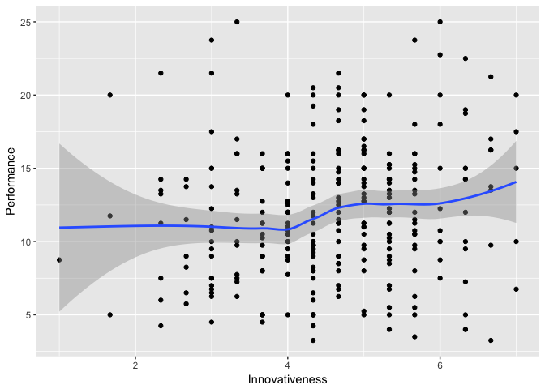

Lab 2
================

Testing an hypothesis using SEM.

> Innovativeness, Proactively, and Risktaking Jointly and Positively Influence Firm Performance

### Project Tasks

-   Figure out SEM
    -   Four spaces do this, SEM stands for SEM --- DONE
-   Import Data, Load Our Data --- DONE
-   Specify Model Equation --- DONE
-   Evaluated Variables --- DONE
-   Variable and Initial Model Visualization --- DONE (but only for Innovativeness and Performance)
-   Specify SEM Workflow --- DONE
    -   Specify Model Syntax and Check With Equation
-   Run the Model --- DONE
-   Model Robustness Checks
    -   Chi-squared
    -   Modification Indices
    -   (Lambda Loadings)
-   Create Results Table

------------------------------------------------------------------------

### Load our data

``` r
# Access the course data from drbanderson.com
library(tidyverse)
Lab2data.ds <- read.csv("http://www.drbanderson.com/data/ENT5587C_Spring2018.csv")
head(Lab2data.ds, 10)
```

    ##    FirmID logFirmAge logEmployees logAssets  logSales PublicPrivate
    ## 1       1          4     2.564949  5.950643  6.349139             1
    ## 2       4          8     3.135494  7.600903  9.093806             1
    ## 3       5          3     2.302585  5.991465  8.006368             1
    ## 4       6          6     3.871201  8.085486  8.309677             1
    ## 5       8          4     3.806663  8.517193  9.933046             1
    ## 6       9          5     2.302585  2.302585  4.382027             1
    ## 7      10          9     3.806663  9.003070  8.783549             1
    ## 8      12          5     3.555348  9.570041 10.249061             1
    ## 9      15          3     1.791759  5.703783  6.813445             1
    ## 10     21          5     1.609438  6.109248  7.047517             1
    ##    IndepDivision SellGlobally INN1 INN2 INN3 PRO1 PRO2 PRO3 RISK1 RISK2
    ## 1              0            1    4    4    4    7    1    1     1     2
    ## 2              0            0    5    6    6    6    6    3     6     5
    ## 3              0            0    7    5    7    7    7    5     4     5
    ## 4              0            1    5    5    5    6    5    5     4     4
    ## 5              0            0    7    7    7    6    6    6     5     6
    ## 6              0            1    5    1    1    4    1    4     4     1
    ## 7              0            1    5    4    4    5    5    5     5     6
    ## 8              0            0    6    5    5    5    6    6     5     5
    ## 9              0            0    3    5    5    3    5    4     3     3
    ## 10             0            1    7    6    7    4    7    5     5     6
    ##    RISK3 GLB1 GLB2 HOS1 HOS2 HOS3 DYN1 DYN2 DYN3 DYN4 SL1 SL2 SL3 PERF1
    ## 1      2    4    2    3    2    2    4    4    4    3   7   7   7    12
    ## 2      4    5    6    6    6    6    5    2    2    2   5   4   6    12
    ## 3      6    5    4    4    4    5    3    4    4    3   5   5   6    12
    ## 4      6    4    2    3    4    5    5    6    6    4   6   5   5    15
    ## 5      5    3    6    6    7    7    3    5    5    2   7   7   7    10
    ## 6      1    1    6    3    3    4    3    4    3    4   5   5   5    25
    ## 7      5    6    5    2    7    5    6    5    5    4   4   6   6    20
    ## 8      6    5    5    2    4    3    6    6    5    4   7   5   6    15
    ## 9      3    3    3    3    5    3    5    5    3    3   6   6   5    10
    ## 10     4    7    7    4    7    2    7    7    7    3   5   7   6    12
    ##    PERF2 PERF3 PERF4 PERF5 PERF6 PERF7 PERF8 OL1 OL2 OL3 OL4 OL5 OL6 OL7
    ## 1     12    12    12    12    12    12    12   2   3   6   6   3   4   4
    ## 2     12    10    10    10    10    10    15   6   6   6   3   6   5   6
    ## 3     12    12    12    12    12    12    12   4   4   4   5   6   5   4
    ## 4     16    16    16    20    16    15    15   5   3   5   4   6   5   6
    ## 5     10    10    10    10    10    10    10   6   5   6   3   7   7   6
    ## 6     25    25    16    20    25    20    20   3   4   4   4   5   3   4
    ## 7     20    20    20    20    20    20    16   6   4   5   5   5   5   6
    ## 8     15    15    16    15    12    16    16   4   4   5   6   5   6   6
    ## 9     10    15    12    16    12     9     9   5   4   5   4   4   4   4
    ## 10    12    15    12    15    20    15    20   7   7   6   7   6   6   6
    ##    OL8 OL9 OL10 OL11 OL12 OL13 OL14 OL15 OL16 OL17 OL18 OL19 IV1 IV2
    ## 1    6   6    6    7    6    5    5    6    6    6    4    7   7   2
    ## 2    6   5    5    6    3    5    5    7    5    6    3    6   5   6
    ## 3    4   4    4    3    3    4    5    3    5    4    3    4   5   4
    ## 4    5   7    6    7    5    6    6    7    7    7    5    3   6   2
    ## 5    6   5    6    2    3    5    5    7    7    6    5    7   7   6
    ## 6    4   3    4    3    3    3    4    4    4    4    5    4   5   6
    ## 7    5   4    5    6    5    5    5    7    5    5    4    6   4   5
    ## 8    6   6    7    3    3    6    7    6    6    7    3    7   7   5
    ## 9    5   5    5    5    5    5    3    5    5    5    4    6   6   3
    ## 10   6   6    7    7    7    5    6    6    2    7    4    7   5   7
    ##        Risk Performance
    ## 1  1.666667       12.00
    ## 2  5.000000       10.50
    ## 3  5.000000       12.00
    ## 4  4.666666       17.00
    ## 5  5.333334       10.00
    ## 6  2.000000       21.50
    ## 7  5.333334       20.00
    ## 8  5.333334       15.25
    ## 9  3.000000       13.25
    ## 10 5.000000       13.50

------------------------------------------------------------------------

### Specify model equation

*P**e**r**f**o**r**m**a**n**c**e* = *α* + *β*<sub>*I**n**n**o**v**a**t**i**v**e**n**e**s**s*</sub> + *β*<sub>*P**r**o**a**c**t**i**v**e**n**e**s**s*</sub> + *β*<sub>*R**i**s**k**T**a**k**i**n**g*</sub> + *ϵ*

------------------------------------------------------------------------

### Evaluation variables

``` r
# create the innovativeness, proactiveness, and risk taking variables and select only varibles I need

Lab2data.df <- Lab2data.ds %>%
  mutate(Innovativeness = (INN1+INN2+INN3) / 3,
         Proactiveness = (PRO1+PRO2+PRO3) / 3,
         RiskTaking = (RISK1+RISK2+RISK3) / 3) %>%
  select(FirmID, Performance, Innovativeness, Proactiveness, RiskTaking)
```

Next we evaluate the distribution of the variables

``` r
library(skimr)
skim(Lab2data.df)
```

    ## Skim summary statistics
    ##  n obs: 294 
    ##  n variables: 5 
    ## 
    ## Variable type: integer 
    ##  variable missing complete   n   mean     sd p0   p25 median    p75 p100
    ##    FirmID       0      294 294 303.68 177.71  1 155.5  310.5 460.75  608
    ##      hist
    ##  ▇▆▇▅▆▆▇▆
    ## 
    ## Variable type: numeric 
    ##        variable missing complete   n  mean   sd   p0  p25 median   p75
    ##  Innovativeness       0      294 294  4.58 1.14 1    4      4.67  5.33
    ##     Performance       0      294 294 11.92 4.5  3.25 9     11.5  15   
    ##   Proactiveness       0      294 294  4.55 1.11 1.33 4      4.67  5.33
    ##      RiskTaking       0      294 294  4.3  1.17 1    3.67   4.33  5   
    ##  p100     hist
    ##     7 ▁▁▃▇▇▇▃▃
    ##    25 ▃▃▇▆▆▂▂▁
    ##     7 ▁▂▃▇▇▆▅▂
    ##     7 ▁▁▂▇▅▃▃▁

------------------------------------------------------------------------

### Variable and initial model visualizations

Focusing only on innovativeness and performance but should be done with all three predictors against performance.

``` r
qplot(Innovativeness, Performance, data = Lab2data.df,
      geom = c("point", "smooth"))
```



------------------------------------------------------------------------

### Specify model syntax and run model

``` r
library(lavaan)

#Specify model syntax
perf.model.syntax <- 'Performance ~ Innovativeness + Proactiveness + RiskTaking'

#run the model
perf.model <- sem(perf.model.syntax, data=Lab2data.df)

#display model results
summary(perf.model)
```

    ## lavaan (0.5-23.1097) converged normally after  24 iterations
    ## 
    ##   Number of observations                           294
    ## 
    ##   Estimator                                         ML
    ##   Minimum Function Test Statistic                0.000
    ##   Degrees of freedom                                 0
    ##   Minimum Function Value               0.0000000000000
    ## 
    ## Parameter Estimates:
    ## 
    ##   Information                                 Expected
    ##   Standard Errors                             Standard
    ## 
    ## Regressions:
    ##                    Estimate  Std.Err  z-value  P(>|z|)
    ##   Performance ~                                       
    ##     Innovativeness    0.400    0.283    1.415    0.157
    ##     Proactiveness     0.053    0.324    0.163    0.871
    ##     RiskTaking        0.290    0.291    0.996    0.319
    ## 
    ## Variances:
    ##                    Estimate  Std.Err  z-value  P(>|z|)
    ##    .Performance      19.603    1.617   12.124    0.000
